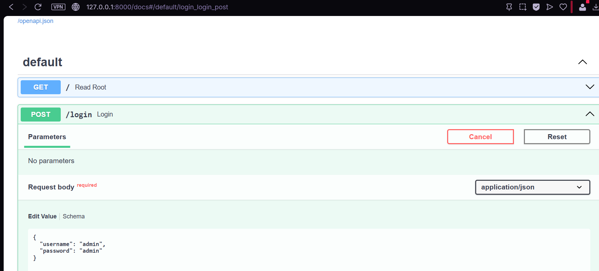
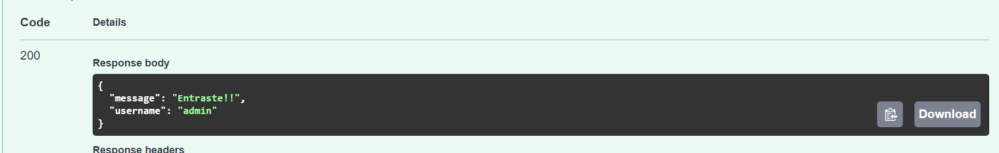

Usuarios disponibles

Los usuarios que hemos puesto son los siguientes con las respectivas contraseñas
1) admin , admin
2) user , user
3) guest , guest

Ejemplos

En esta imagen ingresamos las credenciales para ver si el programa logra encontrarlas en la base de datos

Ya que ejecutamos el codigo podemos ver que las credenciales son correctas por lo tanto tenemos acceso.

